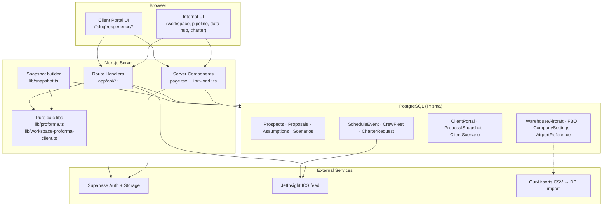

# Atlas Data Flow Audit

Branch: `audit/data-flow-optimization-tweaks` (round 1, merged in PR #13) · `claude/app-audit-continuation-iqivf3` (round 2)  
Date: 2026-06-28 · updated 2026-09-02

This document maps how data moves through Atlas, highlights optimization opportunities, and lists suggested feature tweaks for the audit branch.

---

## Stack Overview

| Layer | Technology |
|-------|------------|
| Frontend | Next.js 14 App Router, React, Tailwind |
| API | Route handlers under `app/api/` |
| Database | PostgreSQL via Prisma |
| Auth | Supabase (internal) + JWT cookies (client portal) |
| Storage | Supabase Storage (media uploads) |

---

## High-Level Architecture



---

## Data Flow by Feature Area

### A. Pipeline (sales dashboard)

```
loadPipelinePage() → PipelineBoard (initialCards from server)
  → click card → ProposalDetailPanel fetches GET /api/proposals/[id]
  → open workspace → RSC load (proposal page)
  → drag stage → PATCH /api/proposals/[id]/pipeline
```

**Key files:** `lib/pipeline-load.ts`, `components/internal/pipeline-board.tsx`, `components/internal/proposal-detail-panel.tsx`

### B. Proposal workspace

```
RSC: proposal + aircraft + owners + comments + sections
Client: local assumption state → debounced persist()
  → POST /assumptions + PATCH /aircraft/[id]
  → scheduleScenarioSync → POST /calculate
  → publish → POST /publish → snapshot + portal
```

**Key files:** `app/aircraft-management/proposals/[id]/page.tsx`, `components/internal/proposal-workspace.tsx`, `lib/publish.ts`, `lib/snapshot.ts`

**Note:** Workspace page currently runs side-effect writes on load (`ensureExperienceSections`, `ensureDraftPortalForProposal`).

### C. Data Hub (reference data)

```
RSC prefetch (aircraft/fbos tabs only) → DataHubClient
Other tabs: client fetch via CrudTab → /api/data/*
Defaults: AircraftType (+ optional AircraftTail) → resolveAircraftDefaults()
```

**Unified aircraft masters:** `AircraftType` (identity, base performance / fuel burn, Crew grids, AM economics, empty-leg default rates) and `AircraftTail` (ops identity, actual weights, empty-leg marketing + rate override). External vendor hooks: `externalSource` / `externalId` / `externalSyncedAt` (JetNet / Conklin later).

**Key files:** `lib/data-hub-prefetch.ts`, `components/internal/data-hub/crud-tab.tsx`, `lib/resolve-aircraft-defaults.ts`

### D. Client portal (slug + PIN)

```
/{slug} → PinGate → POST /verify → JWT cookie
/{slug}/experience/[page] → loadActivePortal() reads snapshot JSON
Pro forma: snapshot.calculationAssumptions → client compute OR POST /scenario
```

**Key rule:** Published proposals render from `proposal_snapshots.snapshot_json` only.

**Key files:** `lib/client-portal-load.ts`, `lib/client-serializer.ts`, `components/client/pro-forma-client.tsx`

### E. Charter schedule

```
JetInsight ICS → POST /schedule/sync → ScheduleEvent table
Schedule page: loadScheduleTimeline() SSR → ScheduleView client refetch
Trip match: POST /charter/match → runTripMatch()
```

**Key files:** `lib/schedule/sync-source.ts`, `lib/schedule/load-timeline.ts`, `components/internal/schedule-view.tsx`

### F. Pro forma calculation

| Context | Server | Client | Persists to DB |
|---------|--------|--------|----------------|
| Internal workspace edits | `POST /calculate` | Debounced 4s sync | `ProposalScenario` metrics |
| Internal pro forma page | `loadProFormaData()` | Optional client reload | `POST /scenarios` |
| Publish snapshot | `buildAircraftSnapshotEntry()` | — | Frozen in `snapshotJson` |
| Portal interactive | `POST /scenario` | `computeWorkspaceProFormaForClient()` when assumptions embedded | Optional `ClientScenario` |

**Key files:** `lib/proforma.ts`, `lib/workspace-proforma-client.ts`, `lib/proforma-load.ts`

---

## Server Prefetch vs Client Fetch

### Good patterns (server prefetch → skip initial client fetch)

| Feature | Server loader | Client component |
|---------|---------------|------------------|
| Pipeline | `loadPipelinePage()` | `PipelineBoard` with `initialCards` |
| Pro forma page | `loadProFormaData()` | `ProFormaView` with `skipInitialLoad` ref |
| Data Hub (2 tabs) | `prefetchDataHubTab()` | `CrudTab` with `initialData` |
| Schedule | `loadScheduleTimeline()` | `ScheduleView` with `initialTimeline` |

### Client-only fetch (optimization candidates)

| Feature | Pattern | File |
|---------|---------|------|
| Pipeline detail panel | Full proposal fetch on open | `proposal-detail-panel.tsx` |
| Comments panel | Mount fetch (may duplicate RSC data) | `proposal-comments-panel.tsx` |
| Data Hub (other tabs) | No server prefetch | `data-hub-prefetch.ts` |
| Portal experience | Client fetch if snapshot missing | `experience-bootstrap-context.tsx` |
| Aircraft defaults | Fetch on aircraft select | `proposal-workspace.tsx` |

---

## Optimization Opportunities

### High impact

| Issue | Location | Recommendation |
|-------|----------|----------------|
| N+1 on publish — per-aircraft DB queries in snapshot build | `lib/snapshot-aircraft.ts` | Batch-load assumptions, owners, warehouse data once per proposal |
| Portal scenario API re-queries DB when snapshot has `calculationAssumptions` | `lib/portal-calculation-assumptions.ts`, `lib/client-serializer.ts` | Skip DB when snapshot is self-contained |
| Draft preview rebuilds full snapshot every navigation | `app/[slug]/experience/[page]/page.tsx` | Cache draft payload or compute once in layout |
| Workspace page writes on read | `app/aircraft-management/proposals/[id]/page.tsx` | Move `ensureExperienceSections` / `ensureDraftPortalForProposal` to creation flow |

### Medium impact

| Issue | Location | Recommendation |
|-------|----------|----------------|
| Double `serializeClientSnapshot()` on pro-forma page | `app/[slug]/experience/[page]/page.tsx` | Compute once, pass same object |
| Pipeline detail duplicates card data | `proposal-detail-panel.tsx`, `pipeline-load.ts` | Lightweight summary endpoint or richer card payload |
| Pipeline loads all assumptions per card | `lib/pipeline-load.ts` | Select only fields needed for missing-info badges |
| Aircraft defaults fetched on select | `proposal-workspace.tsx` | Prefetch defaults in workspace RSC |
| Data Hub tabs without prefetch | `lib/data-hub-prefetch.ts` | Extend prefetch to airports, crew, settings tabs |
| Sequential FBO/warehouse queries | `lib/resolve-aircraft-defaults.ts` | Single Prisma query with includes |

### Lower impact

| Issue | Location |
|-------|----------|
| Pro forma page loads assumptions twice | `pro-forma/page.tsx` + `proforma-load.ts` |
| Schedule refetch with no SWR dedup | `schedule-view.tsx` |
| Full proposal graph returned for panel | `app/api/proposals/[id]/route.ts` |
| Legacy snapshots without embedded assumptions | `pro-forma-client.tsx` |

---

## Feature Tweak Suggestions

1. **Embed full `calculationAssumptions` in every snapshot aircraft entry** — ensures portal never needs live DB for math.
2. **Unify calculate endpoints** — internal `/calculate` vs `/proforma` could share one server function with a `mode` flag.
3. **Extend server-prefetch pattern** — apply to pipeline detail, schedule kanban, charter trips dashboard.
4. **Republish UX** — surface diff summary comparing snapshot metrics vs live calculate.
5. **Portal v2 migration** — consolidate v1/v2 render paths in experience pages.
6. **Observability** — extend `perfTimed()` to publish, snapshot build, and portal scenario API.
7. **iFlightPlanner** — env var exists but no service layer; natural fit for charter trip matching.

---

## External Integrations

| Integration | Status | Entry point |
|-------------|--------|-------------|
| Supabase Auth | Active | `middleware.ts`, `lib/auth.ts` |
| Supabase Storage | Active | `app/api/uploads/route.ts` |
| JetInsight ICS | Active | `npm run db:schedule-sync`, `/api/schedule/sync` |
| OurAirports | Active | `npm run db:ourairports-import` |
| iFlightPlanner | Env only | `IFLIGHTPLANNER_API_KEY` — not wired |
| Postmark | Active | `/api/schedule/inbound-email` |
| EIA fuel index | Active | `lib/eia-fuel-index.ts` |

---

## Key Function Reference

| Function | File | Role |
|----------|------|------|
| `loadPipelinePage` | `lib/pipeline-load.ts` | Pipeline cards |
| `loadProFormaData` | `lib/proforma-load.ts` | 3-scenario pro forma payload |
| `loadActivePortal` | `lib/client-portal-load.ts` | Portal snapshot + branding |
| `buildSnapshotPayload` | `lib/snapshot.ts` | Publish JSON assembly |
| `publishProposal` | `lib/publish.ts` | Snapshot + portal activation |
| `calculateProForma` | `lib/proforma.ts` | Core math |
| `computeWorkspaceProFormaForClient` | `lib/workspace-proforma-client.ts` | Statement + crew + visibility |
| `serializeClientSnapshot` | `lib/client-serializer.ts` | Portal API view model |
| `fetchAndSyncScheduleSource` | `lib/schedule/sync-source.ts` | JetInsight sync |
| `runTripMatch` | `lib/charter/run-trip-match.ts` | Charter aircraft matching |

---

## Recommended Audit Work Order

1. **Publish path** — batch queries in `snapshot-aircraft.ts` (biggest N+1)
2. **Portal pro forma** — skip DB when snapshot has embedded assumptions
3. **Workspace load** — remove side-effect writes from read path
4. **Pipeline panel** — reduce duplicate fetches
5. **Data Hub prefetch** — extend to remaining tabs
6. **Draft preview caching** — avoid full snapshot rebuild per page

---

## Audit Status (2026-09-02)

| # | Work item | Status | What changed |
|---|-----------|--------|--------------|
| 1 | Publish path N+1 | **Done** | `buildAircraftSnapshotList` loads company settings, usage types, and owner profiles once per proposal (`loadAircraftDefaultsSharedPreload`, `loadAllOwnersForProposal`) and hands the already-loaded `AircraftInstance` + `AircraftType` into `resolveAircraftDefaults`, which skips the instance lookup, the warehouse-id existence check, the usage-type lookup, the aircraft-type re-read, and the company-settings read. Per aircraft: ~10 queries → 2 (FBO lookup + hangar override), all in parallel. Every other `resolveAircraftDefaults` caller also drops one query (aircraft type re-read). |
| 2 | Portal pro forma skips DB | **Done (round 1)** | `POST /api/portal/[slug]/scenario` and `serializeClientSnapshot` compute from `calculationAssumptions` embedded in the snapshot; live workspace resolve is draft-preview only. |
| 3 | Workspace writes on read | **Done** | `ensureExperienceSections` / `ensureDraftPortalForProposal` no longer run serially before the page query. The page loads proposal + master templates in parallel and only heals a legacy proposal (missing section rows or no draft portal) when the loaded data shows it is missing. New proposals are seeded at creation (`POST /api/proposals`), so the common path runs zero writes and three fewer sequential round trips. |
| 4 | Pipeline panel duplicate fetch | **Done** | New `GET /api/proposals/[id]/summary` selects only the ~20 fields the detail panel renders (no assumptions, sections, scenarios, or snapshot JSON). `proposal-detail-panel.tsx` uses it; the full `GET /api/proposals/[id]` is unchanged for the workspace. |
| 5 | Data Hub prefetch | **Done (scope reduced)** | `usage-types` added to `prefetchDataHubTab` (the tab already accepted `initialData`). Not extended further because the Data Hub nav was redesigned since round 1: `airports` is now a search-driven audit workbench with nothing to prefetch, the legacy `crew` tab redirects to `aircraft` (already prefetched), and the settings tabs load one small company-settings row. `tails` (crew-fleet + aircraft-type lists) is the remaining candidate. |
| 6 | Draft preview rebuild | **Partially done (round 1)** | `buildSnapshotPayload` takes `fullyResolveAircraftIds` so non-pro-forma draft pages build a lightweight aircraft list and pro-forma pages resolve only the selected aircraft. A cross-navigation cache was not added: draft preview must reflect unsaved workspace edits, so a request-scoped rebuild is the correct behavior. |

### Follow-ups not taken

- **Tails tab prefetch** — `FleetTailsWorkbench` fetches `/api/data/crew-fleet` and `/api/data/aircraft?limit=500` on mount; both could be passed as `initialData` from `app/data-warehouse/data/page.tsx`.
- **FBO lookup per aircraft** — `findFbosAtAirport` + `fboHangarOverride.findUnique` still run once per aircraft at publish (in parallel). A per-ICAO cache inside `AircraftSnapshotBatchPreload` would collapse these when several aircraft share a home base.
- **Test-file type errors** — `tsc --noEmit` reports pre-existing errors only in `*.test.ts` fixtures (stale `ProFormaResult` / `AircraftType` shapes). Vitest does not typecheck, so the suite passes; worth a cleanup pass.
